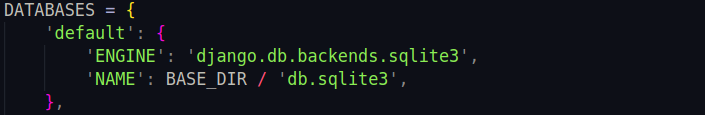
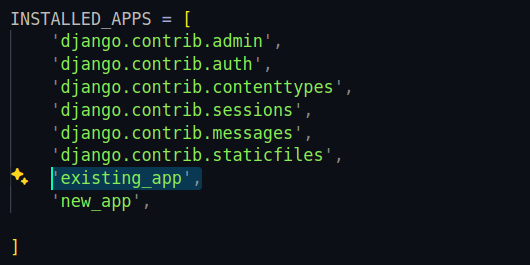
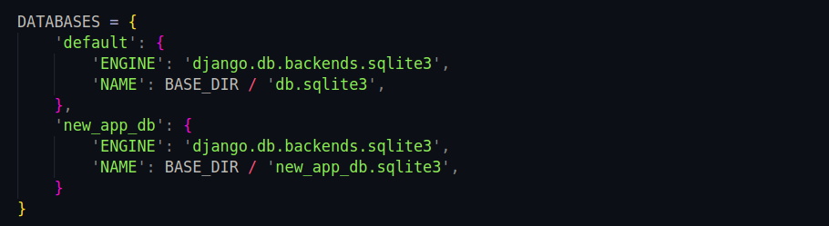
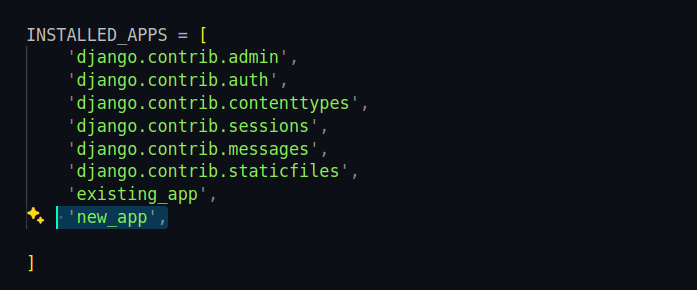

## Tested if we can create Django app inside already existing project with the separate database 

### Project Structure
```
myproject/
    manage.py
    myproject/
        __init__.py
        settings.py
        urls.py
        wsgi.py
        db_router.py
    existing_app/
        __init__.py
        models.py
        views.py
        urls.py
    new_app/
        __init__.py
        models.py
        views.py
        urls.py
    templates/
        example_template.html
```
## Existing Django Project

### Create the Django Project 
```
django-admin startproject myproject
cd myproject
```
- Here existing_app symbolizes the already existing project.

### Create the First Django App

`python manage.py startapp existing_app`

### Configure the Database in settings.py



### Add your new app to the INSTALLED_APPS list



### Create Models for the existing_app 
```
from django.db import models

class ExistingModel(models.Model):
    name = models.CharField(max_length=100)
```

### Run Migrations
```
python manage.py makemigrations
python manage.py migrate
```
## Create Another Django App with a Separate Database

### Create a new app within the same project.
```
python manage.py startapp new_app
```
### Configure the Separate Database in settings.py



### Register the New App in settings.py



### Create Database Router

- Create a database router to direct the new app’s models to the separate database. Create a file db_router.py in your project directory 

```
class NewAppRouter:
    """
    A router to control all database operations on models in the
    new_app application.
    """

    def db_for_read(self, model, **hints):
        """Point all operations on new_app models to 'new_app_db'"""
        if model._meta.app_label == 'new_app':
            return 'new_app_db'
        return None

    def db_for_write(self, model, **hints):
        """Point all operations on new_app models to 'new_app_db'"""
        if model._meta.app_label == 'new_app':
            return 'new_app_db'
        return None

    def allow_relation(self, obj1, obj2, **hints):
        """Allow any relation if a model in new_app is involved."""
        if obj1._meta.app_label == 'new_app' or obj2._meta.app_label == 'new_app':
            return True
        return None

    def allow_migrate(self, db, app_label, model_name=None, **hints):
        """Make sure the new_app's models get created on the right database."""
        if app_label == 'new_app':
            return db == 'new_app_db'
        return None
```

### Add the Router to settings.py


### Create Models for the New App

```
from django.db import models

class NewAppModel(models.Model):
    description = models.CharField(max_length=255)
```

### Run Migrations for the New App 
```
python manage.py makemigrations new_app
python manage.py migrate --database=new_app_db
```

## Access Database

### Access Data from the Default Database
```
from existing_app.models import ExistingModel

existing_records = ExistingModel.objects.all()
```