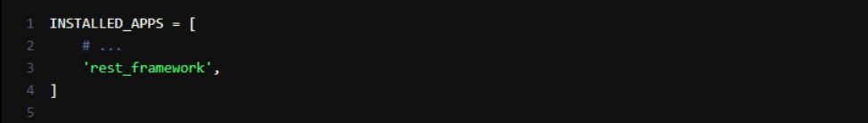
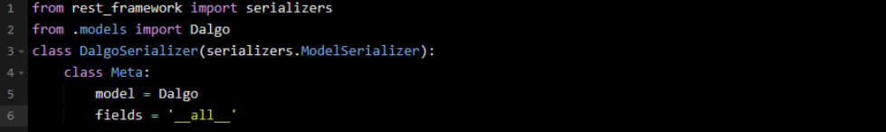
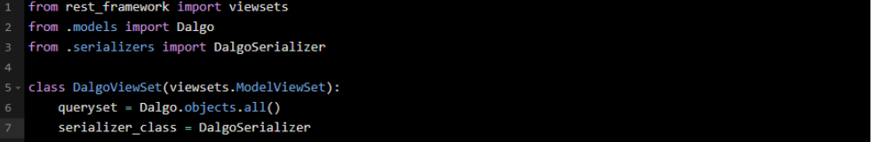

# Project Plan for Dalgo Admin Console 

## Designing and Implementing UI

### Step 1

- Verify the local setup of the project by collaborating with the maintainer, ensuring smooth
installation and configuration processes for development environment components.

### Step 2

- Begin the design phase of the administrative console based on requirements provided by the
mentor, focusing on user interface (UI) and user experience (UX) considerations.

### Step 3

- Begin the design phase of the administrative console based on requirements provided by the
mentor, focusing on user interface (UI) and user experience (UX) considerations.

- Create a React application to implement the designed UI for the administrative console. Set up
the project environment and scaffold the necessary components and dependencies to begin
development.

- Finish building the React UI for the admin console, making sure all the components and features
are in place as designed.

- Address any weaknesses or areas for improvement identified in the design of the administrative
console. Incorporate feedback and guidance provided by the maintainer to refine and enhance
the design accordingly.

## Backend Functionalities

### Step 1

- Dive deep into the Django backend to gain a comprehensive understanding of its structure and
functionality. Discuss with the maintainer to clarify the specific requirements and needs of the
backend for the project.

- Ensure that the Django backend is properly connected to the existing database. Verify that data
can be retrieved, stored, and manipulated as intended, maintaining the integrity of the
application's data management system.

### Step 2

- Establish the connection between the Django backend and React frontend by implementing the
Django RESTful API. Verify that data can be exchanged smoothly between the frontend and
backend, ensuring seamless communication and functionality.

- Verify that frontend authentication is functioning correctly and is synchronized with the
backend. Ensure that users can securely log in, access authorized features, and interact with the
application as intended

**This can be done by following the given steps**

1. First we will need to install Django REST framework: `pip install djangorestframework`

2. After installing DRF, add it to the INSTALLED_APPS in your Django project's settings.py file: 
    

3. Next, we have to define our models in Django, which will form the basis of our database schema. Once our models are defined, create the database tables with:

    `python manage.py makemigrations`

    `python manage.py migrate`

4. Now, we can create serializers for our models. Serializers allow complex data types like querysets and
model instances to be converted to native Python data types that can be quickly rendered into JSON,
XML, or other content types.

    

    *Assuming the name of the app is Dalgo, this is just an example.* 
 
 5. Finally, set up the API views and URL patterns to handle the CRUD operations. DRF provides a set of
views that we can use to build our API quickly:

    

### Step 3

- **Connect React to DJango Backend** 

    **This can be done following these steps -**

1. Request HTTP to the Django backend to connect our React app to the Django API endpoints we've just
created. This is where we'll encounter Cross-Origin Resource Sharing (CORS) policies, which are security
measures that restrict web browsers from making requests to a domain different from the one that
served the web page.

    To handle CORS, we have to configure the Django backend, to accept requests from the React frontend.

    We can do this by adding django-cors-headers

    `pip install django-cors-headers`

2. Then we have to add it to INSTALLED_APPS and middleware in settings.py file.

3. We can now make API requests in our React components using Axios.

    This React component fetches Dalgo from the Django API upon mounting. It uses the axios.get method
    to make a GET request to the specified endpoint. The retrieved data updates the component's state,
    prompting a re-render to display the todos. This process establishes a connection between the React
    frontend and the Django backend, enabling smooth data exchange.

### Step 4

1. Review the overall structure of the project to ensure it aligns with the expected goals and
objectives. Verify that the project organization, architecture, and implementation meet the
desired standards and effectively fulfill the project requirements. Make any necessary
adjustments to ensure the project's integrity and coherence.

## Troubleshooting, Testing and Documentation

### Step 1

1. Focus on managing the pages created for infrastructure components such as Airbyte jobs and
Prefect Jobs. Ensure that these pages are effectively structured, provide relevant information,
and facilitate efficient user interaction.

2. Implement mechanisms to monitor and track metrics related to job history and performance.
This includes recording data on job durations, historical analysis of jobs by connection or client,
and insights into machine utilization patterns throughout the day. Ensure that these metrics are
accurately captured and presented in a user-friendly manner for analysis and decision-making.

### Step 2

1. Utilize the pytest framework to conduct comprehensive testing, covering various types of
software tests such as unit tests, integration tests, end-to-end tests, and functional tests. These
tests will ensure the reliability and functionality of both the frontend and backend components.

2. Monitor and assess test coverage to ensure it meets the target of 80%. Identify any gaps in test
coverage and implement additional tests as needed to achieve the desired level of coverage. This
will help identify potential issues and vulnerabilities within the application, allowing for timely
resolution before deployment.

### Step 3

1. Review the test suite to ensure that all aspects of the application are adequately covered, as
instructed by the mentor. Make adjustments or additions to tests as necessary to achieve
comprehensive coverage.

2. Document the entire development journey, including design decisions, implementation details,
challenges faced, and solutions applied. This documentation will serve as a valuable resource for
future reference and maintenance of the project.

3. Dedicate time to troubleshooting any remaining bugs or issues identified during testing or
implementation. Address these issues systematically, ensuring that the application is free from
critical defects before deployment.
